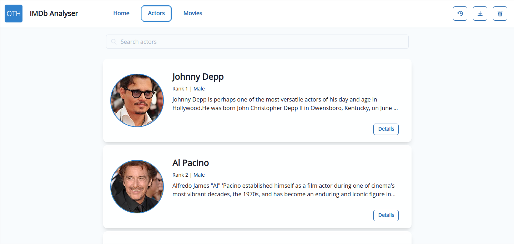
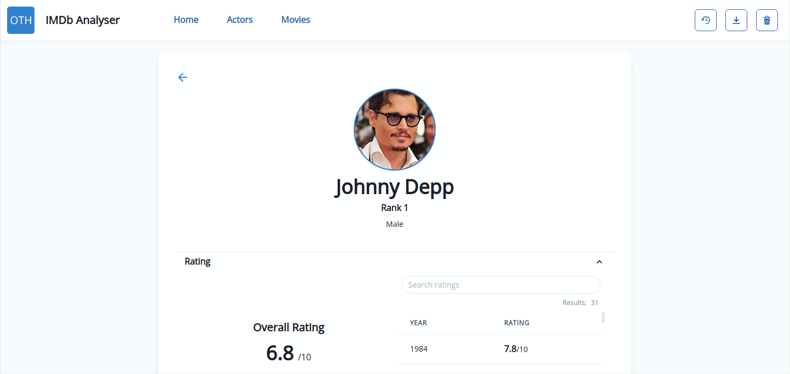
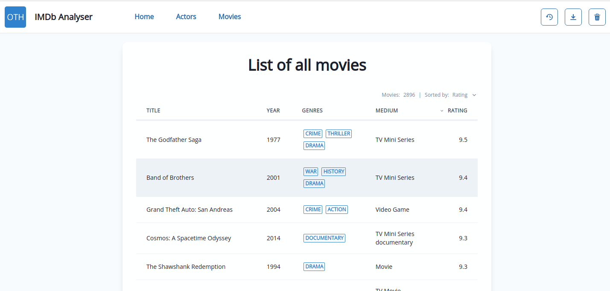
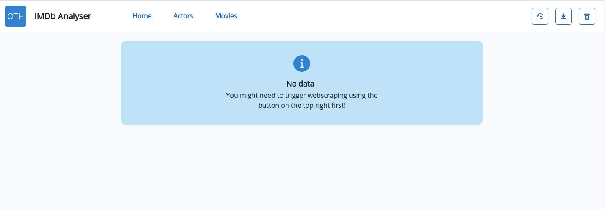
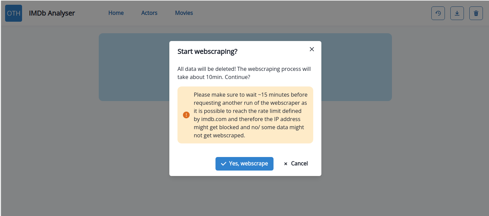
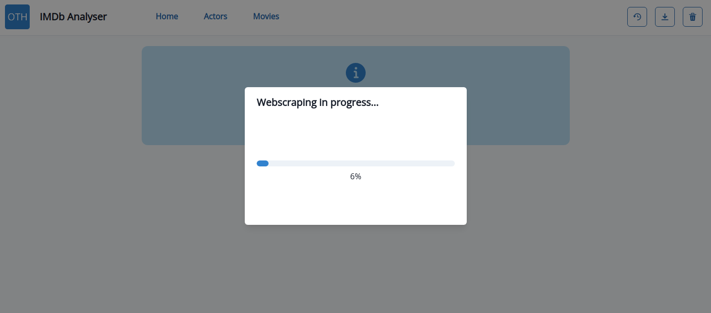
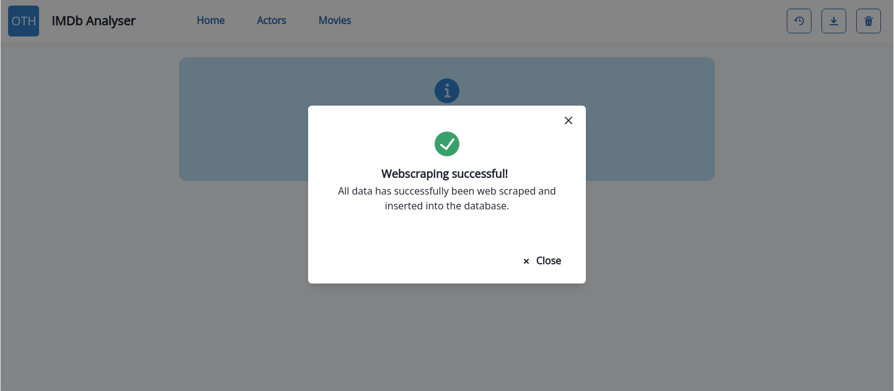
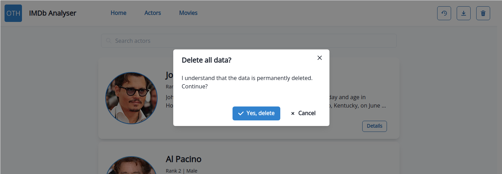
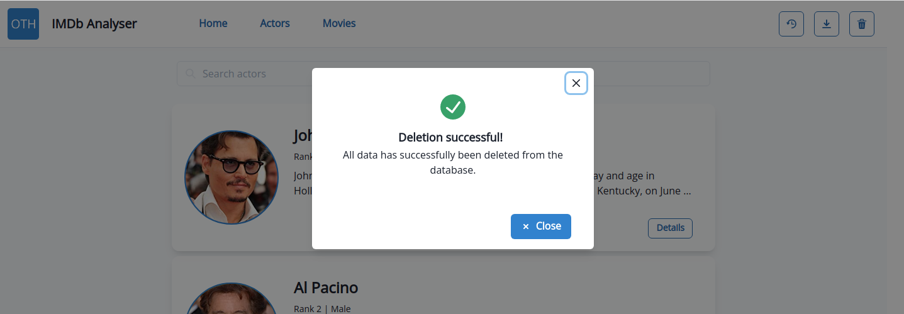

# IMDb Webscraping Project
Assessment for "Applied Data Science with Python" course taught at OTH Regensburg by Istvan Lengyel, Senior Lecturer at EIT, Napier, NZ.

## Table of Contents
- [IMDb Webscraping Project](#imdb-webscraping-project)
  - [Table of Contents](#table-of-contents)
  - [Getting started](#getting-started)
  - [Repository structure](#repository-structure)
  - [User documentation](#user-documentation)
    - [Pages](#pages)
      - [List of actors](#list-of-actors)
      - [Actor details](#actor-details)
      - [List of movies](#list-of-movies)
    - [Load data/ start webscraping](#load-data-start-webscraping)
    - [Delete all data](#delete-all-data)
    - [Export data as .csv](#export-data-as-csv)
    - [Get logs](#get-logs)
  - [Services](#services)
    - [Web application](#web-application)
      - [Frontend](#frontend)
      - [Backend](#backend)
    - [PostgreSQL](#postgresql)
    - [pgAdmin](#pgadmin)
  - [Requirements](#requirements)
  - [License](#license)


## Getting started
The application is deployed as a complete application stack. To make that work you need to have two things installed:
- [Docker](https://docs.docker.com/get-docker/): container runtime to run paravirtualized workloads (= container)
- [docker-compose](https://docs.docker.com/compose/install/): allows to deploy a stack of containers

Second, you need to clone this repository:
```bash
git clone https://github.com/Mushroomator/kpi-collection.git
```

Now move into the cloned repository
```bash
cd IMDb-Webscraping-Project
```
and deploy the stack on your local machine
```
docker-compose up
```
> Note: At first run this command will take some time as all containers must be downloaded first before they get started by the Docker engine.

You can check whether the deployment was successful by running `docker ps -a` which displays all currently running containers on the system.
As each of the deployed containers has a healthcheck configured to ensure the service runs as expected, you can also check the current health status for a container using this command.
Wait a few seconds and run `docker ps -a` again and you should see the status of the containers going from *starting* to *healthy*. That's when every thing is ready to go. You should get an output similiar to the following table:

| CONTAINER ID | IMAGE                              | ... | STATUS                  | PORTS                                      | NAMES         |
| ------------ | ---------------------------------- | --- | ----------------------- | ------------------------------------------ | ------------- |
| cc7b6b081254 | postgres:14.0-alpine               | ... | Up 2 minutes (healthy) | 0.0.0.0:5432->5432/tcp, :::5432->5432/tcp  | postgres-db   |
| df3e6dd5c141 | dpage/pgadmin4:6.2                 | ... | Up 2 minutes (healthy) | 0.0.0.0:80->80/tcp, :::80->80/tcp, 443/tcp | pgadmin       |
| 7d0a99cef6b0 | ghcr.io/mushroomator/imdb-analyser | ... | Up 2 minutes (healthy) | 0.0.0.0:5000->5000/tcp, :::5000->5000/tcp  | imdb-analyser |

You may now access pgAdmin on [http://localhost:80](http://localhost:80) and login as `admin` user using the password `simplepw` or access the web GUI for the application by visiting [http://localhost:5000](http://localhost:5000).

Using the following command you can later stop the complete ^^°°°°°°°°°°°stack:
```bash
docker-compose down
```

## Repository structure
Here is a list of the most important directories and their content within this repository:
- [backend](backend/): Code for the backend
- [charts](charts/): Chart of visualizing the application stack and an ERD
- [docs](docs/): All files related/ required for the documentation of this project
- [frontend](frontend/): Code for the frontend
- [pgAdmin](pgAdmin/): Confiuration files for pgAdmin
- [PostgreSQL](PostgreSQL/): Configuration files/ queries for PostgreSQL database

## User documentation
### Pages
There are three main pages within the application

#### List of actors
Shows a list of all 50 actors listed [here](https://www.imdb.com/list/ls053501318/). You may also search for a specific actor.


#### Actor details
Shows all details on an actor/ actress i. e. their awards, movies, ratings, rank, genres, an image and a short biography.


#### List of movies
Shows a list of all movies within the database. You can sort the table by each of the available columns by clicking on the respective column.


### Load data/ start webscraping
When you first visit the application at [http://localhost:5000](http://localhost:5000) there won't be any data to be displayed as webscraping must be manually triggered first using the button on the top right.


When clicking on the button you must confirm that you want to start webscraping.


After confirmation a progress bar will always show you the current progress of the webscraping process. The process will take approximately 17 minutes.


When the process is finished click `Close` and refresh the page if necessary to show the results.


In case the webscraping failed, wait a few minutes (to ensure the imdb.com is not blocking the IP due to the huge rate of requests) and restart the webscraping process.


### Delete all data
You can delete all data in the database manually. To do so select the button on the top right and confirm the deletion when prompted.


Deletion only takes a short amount of time and you will be notified whether the deletion was successful.


### Export data as .csv
After the webscraping process is done the data is written to the database and can be viewed by using [pgAdmin](#pgadmin) and they are also written to .csv files within the container at `/imdb-analyser-project/backend/data`. You can copy those files out of the container to your host system using the [docker cp command](https://docs.docker.com/engine/reference/commandline/cp/):
```
docker cp imdb-analyser:/imdb-analyser-project/backend/data/ path/to/data/on/your/host
``` 

### Get logs
Each container writes its logs and you can access those with `docker logs <container-name>`. By using the `-f` option you will attach the terminal to the stream of logs and get the logs live as they are written.

## Services
### Web application
The web application can be accessed at [http://localhost:5000](http://localhost:5000) with any browser installed on your system. The docker images for the applcation is hosted on the Github Container Registry [here](https://github.com/Mushroomator/IMDb-Analyser/pkgs/container/imdb-analyser).

#### Frontend
[React.js](https://reactjs.org/) application written in [TypeScript](https://www.typescriptlang.org/) using [Chakra UI component library](https://chakra-ui.com/). The frontend takes care of routing by using [React Router](https://reactrouter.com/) and will fetch required data from the API when needed. Using the Web GUI it is possible to start webscraping, deleting database content or just view the results.

#### Backend
The backend was written using Python 3.9. [Flask](https://flask.palletsprojects.com/en/2.0.x/) was used to as the web framework.

### PostgreSQL
Persistence is provided by a PostgreSQL database running inside of the container. The container exposes default port `5432` within the created user-defined Docker network so the [web app](#web-application) can access it using TCP. All data is persisted to the created volume `db-data`.
The [official PostgreSQL docker image](https://hub.docker.com/_/postgres) was used for this container. 

### pgAdmin
You can access pgAdmin by visiting [http://localhost:80](http://localhost:80) on your browser. Login using the username `admin@postgres.com` and password `simplepw`. After login you will find the connection to the [PostgreSQL database server](#postgresql) already pre-configured. Click on the collection re-enter the password and inspect the database contents using the [Query Tool](https://www.pgadmin.org/docs/pgadmin4/6.2/query_tool.html). The [official pgAdmin docker image](https://hub.docker.com/r/dpage/pgadmin4) was used for this container.

## Requirements
The Python backend relies on ordered dictionaries so a **Python version >= 3.7** is needed for the application to work correctly. The provided Docker image uses Python 3.9 as this was also used during development.

## License
Copyright 2021 Thomas Pilz

Licensed under the Apache License, Version 2.0 (the "License");
you may not use this file except in compliance with the License.
You may obtain a copy of the License at

[https://www.apache.org/licenses/LICENSE-2.0](https://www.apache.org/licenses/LICENSE-2.0)

Unless required by applicable law or agreed to in writing, software
distributed under the License is distributed on an "AS IS" BASIS,
WITHOUT WARRANTIES OR CONDITIONS OF ANY KIND, either express or implied.
See the License for the specific language governing permissions and
limitations under the License.